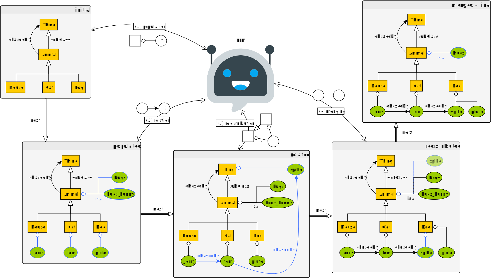
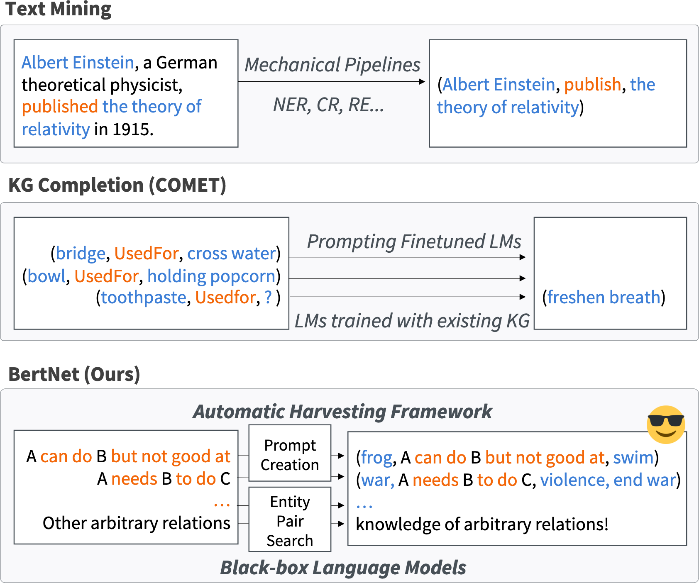

+++

title = "IA Generativa: Tecnologie ed Esempi di Utilizzo"
description = "Formazione su IA generativa"
outputs = ["Reveal"]

+++

{}

# IA Generativa: Tecnologie ed Esempi di Utilizzo

[Giovanni Ciatto](mailto:giovanni.ciatto@unibo.it), Dipartimento di Informatica — Scienza e Ingegneria (DISI), Sede di Cesena,
<br> Alma Mater Studiorum—Università di Bologna



<span class="hint">(versione presentazione: )</span>


---

## Link a queste slide

<>


[<i class="fa fa-print" aria-hidden="true"></i> versione stampabile](?print-pdf&pdfSeparateFragments=false)

---

## Scaletta

1. [Introduzione](#intro)
2. [Principali soluzioni tecnologiche](#interfaces)
3. [Principali modalità d'utilizzo](#modes)
    1. [Esempio di GenAI come motore di ricerca](#search-engine)
    2. [Esempio di GenAI come assistente di (ri)scrittura](#writing)
    3. [Esempio di GenAI come assistente di lettura](#reading)
    4. [Esempio di GenAI come assistente per l'elaborazione dei dati](#data-processing)
    5. [Esempio di GenAI come generatore di contenuti](#content-generation)

{}

---



## __GenAI__: Intelligenza Artificiale _Generativa_

<!-- > [Sistemi basati su] <br> -->
Algoritmi di _IA_ in grado di __generare automaticamente__ _contenuti_, e.g.:
- _testo_
- immagini
- audio e/o video
- codice [di programmazione]
- ...

(cf. [Policy per un uso etico e responsabile dell’Intelligenza Artificiale Generativa nelle attività di didattica e ricerca](https://www.unibo.it/it/allegati/policy-per-un-uso-etico-e-responsabile-dell2019intelligenza-artificiale-generativa-nelle-attivita-di-didattica-e-ricerca/@@download/file/Policy-Generative-AI.pdf))

---

## GenAI mediante _Modelli Fondazionali_ (FM)

+ Grosse _reti neurali_ che imparano ad _elaborare_, _"capire"_, e _produrre_ __dati non__ [necessariamente] __strutturati__
+ __allenati__ su _grandi_ quantità di dati, e con _grandi_ risorse computazionali, a __fare un po' tutto__
    - con l'idea di poterli poi __specializzare__ per _compiti specifici_

<br>


---

## __Terminologia__: Modelli Fondazionali vs. _Large Language Models_



---

{}

## GenAI con modello di consumo _as-a-Service_



---

## GenAI con modello di consumo _as-a-Service_

- Modelli di __costo__:
    + ad __abbonamento__: si paga un _canone_ fisso mensile/annuale per avere accesso al servizio
        * spesso contiene comunque _limiti_ di consumo
    + a __consumo__: si paga in _proporzione_ all'uso effettivo del servizio

- __Consumo__ è misurato in base allo _sforzo computazionale_ necessario per servire la richiesta:
    + _token_ processati (per testo)
    + quantità di _richieste_ effettuate per unità di tempo (minto, ore, giorno, mese)
    + _dimensione_ dei dati processati (per immagini, audio, video)
    + _complessità_ dello specifico _modello_ impiegato per per servire la richiesta

- La __generazione__ da considerarsi un processo _stocastico_, per costruzione

{}
> - La __qualità__ del servizio è soggetta a casualità e a _fluttuazioni_ dovute a:
>    + _carico_ del servizio
>    + scelta del modello, e relativo _aggiornamento_
>    + _limiti_ di servizio eventualumente raggiunti nel _quanto di tempo_ corrente
>    + caso
{}

{}

---

{}

## Ciclo di _apprendimento_ di GenAI



---

## Ciclo di _apprendimento_ di GenAI — __Conseguenze__ (pt. 1)

- __Bias__ di __campionamento__: GenAI conosce _solo_ ciò su cui è stato _allenato_ + pia speranza che impari a _generalizzare_

- L'apprendimento usa dati presi __dal Web__ + eventuali __dati aziendali__ del fornitore del servizio
    + comprovato impiego delle _interazioni_ degli utenti precedenti come _feedback_ per allenamenti successivi

{}
##

> - Informazioni di __nicchia__ possono <u>non</u> essere apprese correttamente (o affatto)
> - Fondamentale __evitare di convididere__ informazioni _sensibili_, _confidenziali_, o protette da _diritti d'autore_
{}

---

## Ciclo di _apprendimento_ di GenAI — __Conseguenze__ (pt. 2)

- Cicli di apprendimento estramente __costosi__ in termini di _denaro_ e _risorse computazionali_...

- ... eseguiti __periodicamente__ (settimane? mesi?) per migliorare la _qualità_ del servizio
    + il modello di consumo _as-a-Service_ permette all'utente di avere accesso traspente al servizio _aggiornato_


{}
##

> - Informazioni __recenti__ potrebbero <u>non</u> essere state (ancora) _apprese_
> - Rischio di ricevere risposte __datate__ o _manchevoli_ da GenAI
> - GenAI dà l'_impressione_ di star imparando __durante la conversazione__, ma in realtà lo fa _offline_
{}

---

## Alcune soluzioni tecnologiche permettono di _scegliere_ (pt. 1)


<br/>


---

## Alcune soluzioni tecnologiche permettono di _scegliere_ (pt. 2)


<br/>


---

## Alcune soluzioni tecnologiche permettono di _scegliere_ (pt. 3)


<br/>


---

## Alcune soluzioni tecnologiche permettono di _scegliere_ (pt. 4)


<br/>


{}

---



# Principali soluzioni __tecnologiche__

## Categorizzate per tipo di __interfaccia__

- _Conversazionali_: e.g. [ChatGPT](https://chatgpt.com/), [Claude](https://claude.ai/login?returnTo=%2F%3F), [Scite](https://scite.ai)
- _Auto-completamento_: e.g. [GitHub Copilot](https://github.com/features/copilot)
- _Programmatiche_: e.g. [OpenAI Platform](https://openai.com/api/), [Hugging Face](https://huggingface.co/)
- _In-App_: e.g. [Microsoft 365 Copilot](https://www.microsoft.com/it-it/microsoft-365/copilot?market=it)
- _Editing di audio-visivi_: e.g. [Suno](https://suno.com/), [Runway](https://runwayml.com/)
<!-- - _Ispezione di materiale generato_: e.g. [GPTZero](https://gptzero.me/), [ZeroGPT](https://www.zerogpt.com/) -->

{}Lista non esaustiva!{}

---

## Interfaccia __conversazionale__

{}
{}


{}
{}
<br>

- Interazione _testuale_ che mima una _corrispondenza_ (__chat__)
    + l'utente chiede, l'IA risponde _reattivamente_
- L'interfaccia permette l'inserimento di un __prompt__
    + opzionalmente contenente _allegati_ (e.g. immagini, documenti)
- Le risposte sono __contestuali__
    + i.e., lo _storico_ della conversazione impatta le risposte _future_
- La risposta contiene __testo__ (spesso _formattato_)
    + opzionalmente: _immagini_, URL, codice

{}

### Talvolta...

- ... prima di rispondere, l'IA fa una __ricerca__ su _Web_
- importante per avere risultati _aggiornati_

{}

{}
{}

---

## Interfaccia basata su __auto-completamento__

{}
{}


{}
{}
<br>

- L'IA _suggerisce_ un __completamento__ per il testo inserito
    + e.g., codice, testo, URL
- L'utente __accetta__ (anche in parte) o _ignora_ il suggerimento
- Usato anche e soprattutto per __codice__ di _programmazione_

{}

### Attenzione...
- ... modello di costo ad __abbonamento__ (vedi [qui](https://github.com/features/copilot/plans))
- ... potenziali __leak__ di informazioni _sensibili_
- ... rischio di __lock-in__ non trascurabile

{}

{}
{}

---

## Interfaccia __programmatica__

{}
{}

```python
import asyncio
from openai import AsyncOpenAI

client = AsyncOpenAI(api_key="sk-1234567890abcdef1234567890abcdef")

async def main():
    stream = await client.chat.completions.create(
        model="gpt-4",
        messages=[
            dict(role="user",
                 content="European countries, one by line")
        ],
        stream=True,
    )
    async for chunk in stream:
        print(chunk.choices[0].delta.content or "", end=", ")

asyncio.run(main())
```

Output:
```plaintext
Albania, Andorra, Austria, Belarus, Belgium, Bosnia and Herzegovina, Bulgaria, Croatia, Cyprus, Czech Republic, Denmark, Estonia, Finland, France, Germany, Greece, Hungary, Iceland, Ireland, Italy, Kosovo, Latvia, Liechtenstein, Lithuania, Luxembourg, Malta, Moldova, Monaco, Montenegro, Netherlands, North Macedonia, Norway, Poland, Portugal, Romania, Russia, San Marino, Serbia, Slovakia, Slovenia, Spain, Sweden, Switzerland, Turkey, Ukraine, United Kingdom, Vatican City (Holy See),
```
{}
{}

- __Linguaggio di programmazione__ che interagisce con IA
    + e.g., _Python_, JavaScript

- L'interazione rimane di tipo _richiesta-risposta_
    + il __programma__ invia una _richiesta_, l'IA _risponde_

{}

### Abilitante per

- Prompt __parametrici__, risposte processate _automaticamente_
    + es. `list of LOCALITIES in AREA, one by line`
        + dove `LOCALITIES` $\in$ {`cities`, `regions`, `states`}
        + e `AREA` $\in$ {`Europe`, `Asia`, `Africa`, `America`, `Oceania`}
        + risultati _ordinati alfabeticamente_

- Scrittura __software__ che usa l'IA come __servizio__
    + utile in _industria_ come in _ricerca_

{}

{}

### Attenzione...
- ... modello di costo __a consumo__ (vedi [qui](https://openai.com/api/pricing/))
    + proporzionale al numero di _token_ processati
    + prezzi variabili _per modello_

{}

{}
{}

---

## Interfaccia __in-app__

{}
{}


{}
{}
<br>

- GenAI integrata in __applicazioni__ _desktop_ o _web_
    + e.g., _Microsoft Office_ (Word, Excel, Outlook)

- supporto per interfaccia __conversazionale__ _interna_
    + conversazione intrinsecamente _contestualizzata_

- IA __automatizza__ _operazioni complesse_ (interne all'app)
    + e.g., _scrittura_ di bozze
    + e.g., _generazione_ di formule, grafici

{}

### Attenzione...
- ... modello di costo ad __abbonamento__ (vedi [qui](https://www.microsoft.com/it-it/microsoft-365/copilot?market=it#plans))
- ... potenziali __leak__ di informazioni _sensibili_
- ... rischio di __lock-in__ non trascurabile

{}

{}
{}

---

## Interfaccia per __editing__ di audio-visivi (e.g. _musica_)

{}
{}


{}
{}
- Interazione __one-shot__ per generare il contenuto
    + _input_: descrizione testuale del contenuto
    + _output_: contenuto

- L'interfaccia permette poi
    + _riproduzione_ del contenuto
    + __modifica__ del contenuto
        + e.g., _taglio_ di parti, _modifica_ di tonalità

{}

### Esempio

- ["Canzona di Bacco" (Lorenzo il Magnifico, 1490)](https://it.wikipedia.org/wiki/Il_trionfo_di_Bacco_e_Arianna_(poesia)), rock
    + <https://suno.com/song/cce33ee7-a581-47ae-b9d1-806902e88e47>

{}
{}
{}

---



# Principali __modalità d'utilizzo__

## Categorizzate per __ruolo di GenAI__

### GenAI come...

* ... _motore di ricerca_: uso GenAI per __ricercare__ informazioni
* ... _assistente di (ri)scrittura_: uso GenAI per __(ri)scrivere__ documenti
* ... _assistente di lettura_: uso GenAI per __acquisire informazioni__ da documenti
* ... _assistende per l'elaborazione dei dati_: uso GenAI per __elaborare__ dati
* ... _generatore di contenuti_: uso GenAI per __creare__ contenuti

{}Lista non esaustiva!{}

---



## GenAI come _motore di ricerca_

### Disclaimer

> GenAI __non è__ un _motore di ricerca_ come Google, Bing, DuckDuckGo, etc.

{}

- FM, di base, __non accedono__ al Web (__né interrogano__ qualche sorgente) prima di rispondere
    * alcune tecnologie specifiche possono farlo, ma non c'è garanzia

- FM, di base, rispondono in base a _dati_ e _conoscenze_ acquisite durante __l'allenamento__
    * informazioni _successive_ all'ultimo ciclo di apprendimento potrebbero non essere considerate

- FM possono essere immaginati come __grandi memorie__
    * in cui (porzioni de) lo _scibile umano_ è stato _"registrato"_
    * interrogabili tramite il _linguaggio naturale_

- Le risposte di GenAI non vanno _mai_ accettate __acriticamente__, in quanto suscettibili di _allucinazioni_:
    * __errori__: informazioni fattualmente false o inventate, riportate con sicumera
    * __fraitendimenti__: informazioni fuori contesto o non pertinenti rispetto all'aspettativa dell'utente
    * __bias__: di campionamento delle informazioni, di selezione del motore di ricerca, intrinseci nel linguaggio, etc.

{}

---

## GenAI come _motore di ricerca_

### Razionale

<br>

Possiamo considerare FM come __esperti__ su tematiche che:
* siano temporalmente _consolidate_ $\implies$ diffidare di risposte su temi _recenti_
* siano relativamente _popolari_ $\implies$ diffidare di risposte su temi _di nicchia_

---

## GenAI come _motore di ricerca_

### Consigli sempre validi

<br>

* verificare le __fonti__ menzionate da GenAI
   - esistono davvero? sono aggiornate?

* verificare l'__aderenza__ alle fonti
    - la fonte dice davvero quello che GenAI ha riportato?

* prediligere, se possibile, la __lingua inglese__
    - LLM sono stati sicuramente _esposti_ a più testi _inglesi_ che italiani durante l'_allenamento_

---

{}

## Esempio: esplorazione sull'argomento ["Sistemi multi-agente"](https://en.wikipedia.org/wiki/Multi-agent_system), con _ChatGPT_

<span class="hint">(un argomento complesso qualsiasi, scelgo un mio tema di ricerca così ho un metro di giudizio)</span>

<br>

> Un sistema multi-agente (MAS) è un tipo di sistema composto da __molteplici agenti indipendenti__ (ma _interattivi_), ciascuno capace di _percepire_ il proprio ambiente e di intraprendere _azioni_.
> Gli agenti possono essere _modelli di IA_, programmi _software_, _robot_ e altre _entità computazionali_.
> _Molteplici agenti_ possono _cooperare_ o verso un _obiettivo comune_ che va oltre le capacità dei singoli agenti, con una maggiore adattabilità e robustezza.

(cf. <https://www.gartner.com/en/information-technology/glossary/multiagent-systems>)

<!-- <br>

### Link alla conversazione completa

<https://chatgpt.com/share/e/679a41e7-e164-8004-8f01-d135dde3892c> -->

---

{}
{}

{}
{}
- Definizione sostanzialmente __corretta__
{}
{}

---

{}
{}

{}
{}
- Caratteristiche sostanzialmente __corrette__
{}
{}

---

{}
{}

{}
{}
- Le applicazioni _menzionate_ sono __corrette__
- _Nessuna_ garanzia di __esaustività__
    + __bias__ di campionamento?
{}
{}

---

{}
{}

{}
{}
- _Nessuna_ garanzia di __esaustività__
- Nessun riferimento per [AlphaStar](https://deepmind.google/discover/blog/alphastar-mastering-the-real-time-strategy-game-starcraft-ii/)
- Interserzione con _altre nicchie_
    + __blockchain__, __protocolli di consenso__
{}
{}

---

{}
{}

{}
{}
- Gli aspetti _menzionati_ hanno __fondamenta solide__
- Lista __incompleta__
{}
{}

---

{}
{}

{}
{}
- Tutte menzioni __corrette__
- _Nessuna_ garanzia di __esaustività__
    + __bias__ di campionamento?
{}
{}

---

{}
{}

{}
{}
- [Link ad Arxiv](https://arxiv.org/abs/1706.02275) __corretto__
- Riferimento _adeguato_ al contesto corrente
- Riferimeto __mancante__ a [paper definitivo](https://dl.acm.org/doi/10.5555/3295222.3295385)
{}
{}

---

{}
{}

{}
{}
- Riferimento _adeguato_ al contesto corrente
- [Link ad Arxiv](https://arxiv.org/abs/1903.08082) __incoerente__ col riferimento
- Il paper menzionato ha un __altro URL__:
    + <https://arxiv.org/abs/2011.05373>
- Riferimeto __mancante__ a [paper definitivo](https://dl.acm.org/doi/10.5555/3495724.3497048)
{}
{}

---

{}
{}

{}
{}
- Riferimento _**in**adeguato_ al contesto corrente
- [Link ad Arxiv](https://arxiv.org/abs/1906.01220) __incoerente__ col riferimento
- Il paper menzionato ha un __altro URL__:
    + <https://arxiv.org/abs/1809.03531>
- Riferimeto __mancante__ a [paper definitivo](https://doi.org/10.1109/LRA.2019.2903261)
{}
{}

---

{}
{}

{}
{}
- [Link ad Arxiv](https://arxiv.org/abs/1910.05789) __corretto__
- Riferimento _adeguato_ al contesto corrente
- Riferimeto __mancante__ a [paper definitivo](https://dl.acm.org/doi/10.5555/3454287.3454752)
{}
{}

---

{}
{}

{}
{}
- [Link ad Arxiv](https://arxiv.org/abs/1803.08884) __corretto__
- Riferimento _adeguato_ al contesto corrente
- Riferimeto __mancante__ a [paper definitivo](https://dl.acm.org/doi/10.5555/3327144.3327252)
{}
{}


{}

---

## GenAI come _motore di ricerca_ (pt. 2)

> Uno strumento forse _migliore_ (ma più _costoso_) in ambito accademico,
> <br> potrebbe essere [Scite](https://scite.ai)

-  è un __database bibliografico__ che indicizza le citazioni nel contesto (cf. __"Smart Citation Index"__)
    * citazioni classificate come _supportive_, _mentioning_, o _contrasting_
    * fonte: ["Evaluating the Accuracy of scite, a Smart Citation Index"](https://doi.org/10.18060/26528)

- Fornisce un LLM, [Scite Assistant](https://scite.ai/assistant) ha accesso al database bibliografico
    * interfaccia __conversazionale__
    * _riferimenti bibliografici_ eventualmente presenti nelle risposte vengono arricchiti con __metadati__
        + es. link all'articolo, evidenziazione del testo citato, etc.

---

## Interfaccia di [Scite Assistant](https://scite.ai/assistant)


---

## Esempio: esplorazione sull'argomento ["Sistemi multi-agente"](https://en.wikipedia.org/wiki/Multi-agent_system), con _Scite_



- Riferimenti bibliografici con _ipertesti_, e _metadati_
- Nella parte _destra_, sono riportati i _dettagli_ dei riferimenti bibliografici

---



- {}Non{} fa davvero riferimento alle {}parole chiave menzionate in precedenza{}
- {}Bias di campionamento{}

---



## GenAI come _assistente di (ri)scrittura_

### Razionale

<br>

- __Interrogare__ GenAI per generare testo da riusare __verbatim__ è un approccio {}naïf{}
    + ci si affida in toto a GenAI, col rischio che sfuggano {}allucinazioni{}
    + si rischia di ereditare {}bias{} ed {}errori semantici{} senza accorgersene

{}

> - Approccio più _furbo_: chiedere a GenAI di __rielaborare__ un testo grezzo o _parziale_
>    + es. una lista di _cose da dire_, argomenti da trattare, etc.
>    + _controllo_ e _responsabilità_ del __filo del discorso__ rimangono sull'utente

{}

---

## GenAI come _assistente di (ri)scrittura_

### Consigli sempre validi

<br>

* tenere il _controllo_ di __cosa__ si vuole dire nel testo
* farsi _assistere_ riguardo alla __forma__ del testo
* __rivedere__ il testo prodotto per _errori_, _incongruenze_, _allucinazioni_
    + chiedere opportunamente _variazioni_ fino a soddisfazione
* __rivedere__ eventuali _riferimenti_ a _fonti_ o _citazioni_ per _aderenza_
* chiedersi se non ci sia __mancanza__ di _informazioni_ o _riferimenti_ importanti

---

## Esempio: scrittura _abstract_ di una _SRL_ inerente ["IA Neuro-Simbolica"](https://en.wikipedia.org/wiki/Neuro-symbolic_AI), con _ChatGPT_

<span class="hint">(un argomento complesso qualsiasi, scelgo un mio interesse di ricerca ho un metro di giudizio)</span>

<br>

> IA __Neuro-Simbolica__: la combinazione di metodi _simbolici_ ["IA classica", NdA] con metodi basati su _reti neurali_ artificiali.

(cf. [Neuro-symbolic artificial intelligence](https://ip.ios.semcs.net/articles/ai-communications/aic210084))

> Una __revisione sistematica della letteratura__ (_SLR_) è un metodo accademico indipendente che mira a identificare e valutare tutta la _letteratura_ rilevante su un _argomento_ al fine di trarre conclusioni sulla questione in esame.
> [...]
> Viene seguito un _approccio metodologico formale_ per ridurre le distorsioni causate da una selezione eccessivamente restrittiva della letteratura disponibile e per aumentare l'_affidabilità_ della letteratura selezionata.

(cf. <https://www.tu.berlin/en/wm/bibliothek/research-teaching/systematic-literature-reviews/description-of-the-systematic-literature-review-method>)

---

{}

## Approccio 1 ({}Sconsigliato{}): Senza traccia

<!-- (link alla [conversazione completa](https://chatgpt.com/share/e/679b94b4-93e4-8004-9fae-457ba9f4bf07)) -->



---

{}
{}

{}
{}
1. Frase generica, incontestabile, corretta
2. {}Obietto dell'articolo{}
3. {}Obiettivo generico, sempre buono per rassegna{}
4. {}Contributo specifico: suggerisce struttura articolo{}
5. {}Contributo generico{}
6. {}Contributo specifico{}
7. Frase di chiusura generica

{}
> Uso sostanziale di GenIA
{}
{}
{}

---

## È possibile richiedere modifiche

{}
{}

{}
{}

{}
{}

{}

---

{}

## Approccio 2 (_Consigliato_): Con traccia

<!-- (link alla [conversazione completa](https://chatgpt.com/share/e/679b94c5-17d0-8004-9b4a-6687418f3569)) -->

{}
{}

{}
{}
### La traccia

1. {}Frase d'aggancio{}
2. {}Obiettivo dell'articolo{}
3. {}Descrizione della metodologia{}
4. {}Dichiarazione contributi{}
5. {}Indicazione dell'audicence inteso{}
{}
{}

---

{}
{}

{}
{}
### Analisi del risultato

1. {}Frase d'aggancio{}
2. {}Libera interpretazione di GenIA{}
2. {}Obiettivo dell'articolo{}
3. {}Descrizione della metodologia{}
4. {}Dichiarazione contributi{}
5. {}Indicazione dell'audicence inteso{}

> Uso _non_ sostanziale di GenIA
{}
{}

{}

---

{}

### Altri tipi di supporto alla scrittura

## Supporto alla _traduzione automatica_ (pt. 1)

> Meglio strumenti consolidati (e.g. __Google Translate__) o _modelli fondazionali_ (e.g. __GPT__)?

(posto che la traduzione fatta da esperti _umani_ sarà sempre _migliore_)

---

### Altri tipi di supporto alla scrittura

## Supporto alla _traduzione automatica_ (pt. 2)

Chiediamo a __Scite Assistant__:



---

### Altri tipi di supporto alla scrittura

## Supporto alla _traduzione automatica_ (pt. 3)


<br>

__TL;DR:__ Google Translate è _preferibile_ laddove sia richiesta _precisione_

---

### Altri tipi di supporto alla scrittura

## Supporto alla _traduzione automatica_ (pt. 4)



<br>

__TL;DR:__ GPT _usabile_ laddove il __contesto__ possa aiutare la traduzione

---

### Altri tipi di supporto alla scrittura

## Supporto alla _traduzione automatica_ (pt. 5)

{}
{}

{}
{}
- Richiesta di _transposizione_ in lingua con uno __stile specifico__
- Utile per migliorare la _qualità_ scrittura _in lingua_
{}
{}

{}

---

{}

### Altri tipi di supporto alla scrittura

## Supporto alla _generazione di codice_ di programmazione



(codice suggerito __inefficiente__, ma _funzionante_)

---

### Altri tipi di supporto alla scrittura

## Supporto alla _documentazione del codice_ di programmazione



(spiegazione __corretta__ ed articolata)

{}

---



## GenAI come _assistente di lettura_

### Razionale

<br>

- GenAI può essere usato per _acquisire_ informazioni da __documenti testuali__ [senza leggerli integralmente]
    + e.g., _estrarre highlights_ da un testo, _sintetizzare_ un testo, etc.

- La stessa idea si può applicare a __contenuti multimediali__
    + e.g., _estrarre highlights_ da un video, _trascrivere_ un audio, etc.

{}

> Il testo [o contenuto] da cui estrarre informazioni __deve essere fornito__ dall'_utente_
- _Non presumere_ che GenAI conosca il testo [o contenuto] in questione

{}

---

## GenAI come _assistente di lettura_

### Consigli sempre validi

- Al crescere della _lunghezza_ del testo, aumenta la probabilità di __allucinazioni__
    + idem per _durata_ dei contenuti multimediali

- __Verificiare__ che il testo [o contenuto] fornito _non_ contenga _informazioni_ __sensibili__ o __riservate__

- __Verificare__ di avere il _diritto_ di fornire a _terzi_ [copie de] il contenuto

- Tenere presente la possibilità di inevitabili __distorsioni__
    + _allucinazioni_ $\rightarrow$ l'estrazione potrebbe inventare informazioni non presenti nell'originale
    + _lacune_ $\rightarrow$ elementi importanti portebbero non essere estratti

---

{}

## Esempio: estrazione dalla traccia della __prima prova di Italiano__, _maturità 2024_

Si veda file [P000_ORD24.pdf](https://www.istruzione.it/esame_di_stato/202324/Italiano/Ordinaria/P000_ORD24.pdf) --- 7 pagine, ben dense



---

{}
{}

{}
{}
<embed src="./P000_ORD24.pdf" width="100%" height="100%" />
{}
{}

---

{}
{}

{}
{}

{}
{}

---

## Commenti

- GenAI riesce a __selezionare__ le informazioni _richieste_ dal documento _fornito_
    + e __riportarne__ una _sintesi_

- L'idea è di usare GenAI come un __motore di ricerca__ specifico per il/i documento/i in questione

{}
> - Al crescere della dimensione del documento, aumenta la probabilità di __allucinazioni__, distorsioni, __lacune__
{}


{}

---

{}

## Esempio: __sintesi__ di documento (_Policy di Ateno su GenAI_)

Si veda file [Policy-Generative-AI.pdf](www.unibo.it/it/allegati/policy-per-un-uso-etico-e-responsabile-dell2019intelligenza-artificiale-generativa-nelle-attivita-di-didattica-e-ricerca/@@download/file/Policy-Generative-AI.pdf)



---



---



---



---



---

## Commenti

- GenAI riesce a __sintetizzare__ in poche righe intere pagine di _policy_
    + cogliendo il _senso_ generale del documento

- Rischia di __omettere__ dalla sintesi: sfumature, eccezioni, _casi particolari_

{}
> - Evitare di basarsi __esclusivamente__ sulla sintesi di GenAI per _interpretare_ un testo
> - Utile __fare domande__ _specifiche_ o _maliziose_ sul documento per catturare ulteriori _dettagli_
{}

{}

---

{}

## Esempio: __confronto__ di documenti _diversi_

Confrontiamo due __articoli scientifici__ (su _tema simile_):

{}
{}
<https://arxiv.org/abs/2404.04108>
<embed src="./2404.04108v2.pdf" width="100%" height="700px" />
{}
{}
<https://aclanthology.org/2023.findings-acl.309/>
<embed src="./2023.findings-acl.309.pdf" width="100%" height="700px" />
{}
{}

---

## Esempio: __confronto__ di documenti _diversi_

### Idea di fondo (da <https://arxiv.org/abs/2404.04108>)

<br>



---

## Esempio: __confronto__ di documenti _diversi_

### Idea di fondo (da <https://aclanthology.org/2023.findings-acl.309/>)

<br>



---



---



---



{}

---

{}

## Esempio: __confronto__ di _versioni diverse_ dello _stesso_ documento

> - Per questo caso d'uso, __GenAI__ <u>non</u> è lo strumento migliore
> - Esistono strumenti _più adeguati_, {}non basati su GenAI{}

- e.g. [Git](https://git-scm.com/) + [GitHub](https://github.com/) per __versionare__ documenti testuali, e _collaborare_ alla loro stesura _concorrente_

- e.g. [Draftable](https://www.draftable.com/compare) per __comparare__ documenti Word, _PDF_, etc.

---

## Esempio: __confronto__ di _versioni diverse_ dello _stesso_ documento

Comparatiamo due diverse versioni di <https://arxiv.org/abs/2404.04108>

{}
{}
Aprile 2024:
<https://arxiv.org/abs/2404.04108v1>
<embed src="https://arxiv.org/pdf/2404.04108v1" width="100%" height="700px" />
{}
{}
Dicembre 2024:
<https://arxiv.org/abs/2404.04108v2>
<embed src="https://arxiv.org/pdf/2404.04108v2" width="100%" height="700px" />
{}
{}

---



---

<https://draftable.com/compare/zRbeSplWOCxS>

<iframe src="https://draftable.com/compare/zRbeSplWOCxS" style="border:none;overflow:hidden;" scrolling="no" frameborder="0" allowfullscreen width="100%" height="800px"></iframe>

{}

---

{}

## Esempio: identificazione di _plagio_ (potenziale) in un documento

> - Per questo caso d'uso, __GenAI__ <u>non</u> è lo strumento migliore
> - GenAI può essere usato per _identificare_ __similitudini concettuali__ tra testi
> - Esistono strumenti _più adeguati_, {}non basati su GenAI{}

- e.g. [Compilatio](https://www.compilatio.net/it) software ad hoc per __l'identificazione del plagio__
    + personale UniBO può usufruire gratuitamente

---



---



---

## Esempio: analisi della _novelty_ di un documento



---



{}

---

{}

## Esempio: supporto alla _revisione paritaria_ di un documento ({}sconsigliabile!{})



---



---



---



---

## Esempio: supporto alla _revisione_ di un documento

### Aspetti {}critici{}

<br>

- Upload del paper potrebbe comportare __violazione__ della __riservatezza__
    + ricordarsi _escludere_ il documento dai dati usabili per _futuri cicli di allenamento_

- Si sta __delegando__ a GenAI un processo _critico_, che ha un impatto su _altre persone_ e sulla _comunità_
    + la _responsabilità_ rimane sul revisore umano

- ChatGPT tende ad essere __accondiscendente__ e _positivo_, riportando punti di forza / limitazioni riportati nel documento stesso
    + questo è un bias, che potrebbe rendere la revisione troppo _superficiale_
    + altri LLM potrebbero avere lo _stesso bias_, o _bias opposti_

- Si può richiedere una revisione __aggressiva__ o __critica__ ... spostando il bias verso la _negatività_

{}

> Meglio _limitarsi_ ad __ispezionare__ il documento con GenAI e _farsi un'idea_ prima di esprimere un __giudizio__

{}

{}

---



## GenAI come assistente per _l'elaborazione dei dati_

### Razionale

<br>

- GenAI può essere usato per __elaborare dati__, anche _strutturati_, _semi-strutturati_, o _non strutturati_
    + e.g., _tabelle_, _dataset_, etc.

- Vari __tipi di elaborazione__ possibili, es:
    - (semplicifi) operazioni di _aggregazione_ o _filtraggio_ di dati
    - _visualizzazione_ dei dati
    - creazione di (semplici) modelli _predittivi_
    - _generazione_ di dati _sintetici_

- Si istruisce GenAI ad operare come un __analista dati__ o un __data scientist__
    + fornendo i _dati_ e le operazioni da _eseguire_, valutando i _risultati_

---

## GenAI come assistente per _l'elaborazione dei dati_

### Disclaimer

<br>

- _LLM_, di per loro, sono __imprecisi__ e _non affidabili_ per il calcolo e l'_analisi di dati_
    + specie al crescere del volume dei dati

- Tuttavia, _FM_ posssono generare __codice di programmazione__ (dietro le quinte) per _elaborare_ i dati
    + _compensando_ quindi la _limitata_ capacità di analisi dei LLM

---

## GenAI come assistente per _l'elaborazione dei dati_

### Consigli sempre validi

<br>

- Prima di caricare dati, __verificare__ che non contengano _informazioni sensibili_ o _riservate_, e di avere il _diritto_ di fornirli a _terzi_
    + _escludere_ i dati dai futuri cicli di allenamento

- Fare richieste _precise_, _chiare_, e _possibili_ (rispetto ai dati forniti)
    + riguardanti operazioni che _in linea di principio_ __comprendi__ e che __potresti fare senza GenAI__

- __Non fidarsi ciecamente__ dei risultati, _verificare_ che siano _corretti_
    + specie laddove siano svolti _calcoli_ su dati _numerici_

- Chiedere il __codice sorgente__ delle operazioni svolte, per _verificarle_, e renderle __riproducibili__

- _Non delegare_ a GenAI operazioni che implichino punti di __scelta__ e/o __responsabilità__
    + es. scelta di un _modello predittivo_, scelta di un'_operazione di aggregazione_ o _discretizzazione_, etc.

---

{}

## Esempio: studio _attrattività_ dei corsi UniBO

Sfruttando gli [open-data di Ateneo](https://dati.unibo.it/dataset/degree-programmes-figures),
e ChatGPT,
possiamo velocemente _analizzare_ l'__attrattività dei corsi__ UniBO nel tempo

<br>

{}

### Passi concettuali

1. [Manuale] __scaricare__ i file _CSV_ con i dati dei corsi, _per ogni anno accademico_
2. __convogliare__ tutti i dati in un'unica tabella
3. __aggregare__ i dati per _categoria del CdL_
4. __graficare__ tante _linee temporali_ quante sono le _categorie_ di CdL
5. [Manuale] __interpretare__ i grafici

{}

<br>

{}

{}

---



---



---

{}
{}

{}
{}

{}
{}

---



---



---



---

## Esempio: studio _attrattività_ dei corsi UniBO

### Commenti

<br>

- Rimane da __verificare__ che il _codice generato_ produca _davvero_ i risultati mostrati da GenAI

- Il __codice__ generato da GenAI è ciò che rende l'esercizio _ispezionabile_ e _ripetibile_

- {}Non è saggio delegare{} un aspetto __decisionale__ del processo a GenAI
    + e.g., __interpretare__ i risultati come _successo_ o _fallimento_ di una politica accademica
    + e.g., __categorizzare i CdL__ sulla base del loro _nome_

{}

---

{}

## Esempio: generazione di _dati sintetici_

In contesti _di ricerca_ più essere interessante __generare dati sintetici__, _simili_ a dati reali esistenti

<br>

{}

### Dettagli

(Comunemente, ci vuole __controllabilità__ del _processo_ di generazione)

1. __Senza GenAI__, si procede così:
    1. [Difficile, error-prone] stima della _distribuzione di probabilità_ dei dati reali
    2. _campionamento_ da questa distribuzione

2. __Con GenAI__, si evita la difficoltà del punto 1.1:
    1. istruire GenAI sulle _differenze attese_ rispetto ai _dati reali_, forniti
    2. richiesta di _generazione_
    3. _reiterare_ fino a _soddisfazione_

{}

---

## Esempio: generazione di _dati sintetici_ sul [datset Iris](https://it.wikipedia.org/wiki/Dataset_Iris)

{}
{}

{}
{}
Nuova classe _sintetica_: "Iris Immagina", in giallo


{}
{}

---



---



---



---



---

```python
import pandas as pd
import numpy as np

# Caricare il dataset originale
file_path = "/mnt/data/iris.csv"
iris_df = pd.read_csv(file_path)

# Aggiungere i nomi delle colonne corretti
iris_df.columns = ["sepal_length", "sepal_width", "petal_length", "petal_width", "class"]

# Definire i parametri per la nuova classe
num_samples = 150
sepal_length = np.random.normal(loc=7.0, scale=0.4, size=num_samples)  # Sepalo lungo
sepal_width = np.random.normal(loc=3.2, scale=0.3, size=num_samples)
petal_length = np.random.normal(loc=2.0, scale=0.2, size=num_samples)  # Petalo corto
petal_width = np.random.normal(loc=1.8, scale=0.2, size=num_samples)  # Petalo largo

# Creare il nuovo dataframe
iris_immagina_df = pd.DataFrame({
    "sepal_length": sepal_length,
    "sepal_width": sepal_width,
    "petal_length": petal_length,
    "petal_width": petal_width,
    "class": ["Iris-immagina"] * num_samples
})

# Unire i dati originali con quelli sintetici
extended_iris_df = pd.concat([iris_df, iris_immagina_df], ignore_index=True)
```

<br>

{}

Notare che GenAI ha scelto __arbitrariamente__ (ma _ragionevolmente_):
- di usare _distribuzioni normali_ per i dati sintetici
    + ed i _parametri_ di queste distribuzioni
- di generare dati multi-dimensionali _una componente per volta_

{}

{}
> Come?
{}

---



---

|   Feature  |   Original Mean (All Classes)  |   Original Std (All Classes)  |   Synthetic Mean (Iris-immagina)  |   Synthetic Std (Iris-immagina)  |   Rationale  |
|---|---|---|---|---|---|
|   `sepal_length`  |   5.85  |   0.83  |   7.0  |   0.4  |   Scelto per essere _più lungo_ delle altre specie  |
|   `sepal_width`  |   3.05  |   0.43  |   3.2  |   0.3  |   _Simile a Versicolor_ per non essere un outlier estremo  |
|   `petal_length`  |   3.77  |   1.76  |   2.0  |   0.2  |   _Corto_ per distinguersi dalle altre specie  |
|   `petal_width`  |   1.21  |   0.76  |   1.8  |   0.2  |   _Largo_ per renderlo unico rispetto alle altre specie  |

---

## Commenti

- Rimane da __verificare__ che il _codice generato_ produca _davvero_ i risultati mostrati da GenAI

- Il __codice__ generato da GenAI è ciò che rende l'esercizio _ispezionabile_ e _ripetibile_

- La scelta dei parametri per la generazione dei dati è stata __arbitraria__, ma _ragionevole_
    + ... GenAI ha correttamente _interpretato_ le richieste dell'utente

- Meglio sarebbe <u>non</u> avere questo {}margine di interpretazione{}
    + i.e., l'utente dovrebbe specificare i _dettagli_ di __come__ generare i dati sintetici

{}

---

{}



## GenAI come assistente alla _generazione di contenuti_

### Razionale

- GenAI può essere usata per _generare contenuti_ di vario genere (sia da _zero_ che _modificando_ contenuti esistenti)
    + e.g., _immagini_, _video_, _audio_ etc.

- Per la generazione di __diagrammi__, grafici, etc. è meglio _indurre_ GenAI a generare _codice_, da _renderizzare_ poi con strumenti _dedicati_
    + e.g., codice Python/[Matplotlib](https://matplotlib.org/) per grafici, codice [PlantUML](https://plantuml.com/) per diagrammi UML, etc.

- Può essere utile chiedere a GenAI di generare __loghi__, concept, copertine, etc. per _ispirazione_
    + in generale, GenAI funziona bene dove l'_intuizione_ vale più della _precisione_

---

## GenAI come assistente alla _generazione di contenuti_

### Consigli sempre validi

- __Verificare__ che i contenuti generati siano _originali_ e _non violino_ _copyright_

- __Non delegare__ a GenAI la _scelta_ di _contenuti critici_ o _sensibili_
    + e.g., _scelta_ di un _logo_ per un'azienda, _scelta_ di un _graphical abstract_ per un articolo, etc.

- __Non fidarsi ciecamente__ dei risultati, _verificare_ che siano _corretti_, e non contengano _bias_ o _allucinazioni_

{}

---

{}

## Esempio: generazione di _foto_ di fiori _immaginari_



---

{}
{}
Setosa


<https://www.phytoimages.siu.edu/imgs/Cusman1/na/Iridaceae_Iris_setosa_82970.html>
{}
{}
Versicolor


<https://mgnv.org/plants/native-plants/perennials/iris-virginica/>
{}
{}
Virginica


<https://bhwp.org/item/northern-blue-flag-iris-iris-versicolor/#tab-wccpf_fields_tab>
{}
{}

---



---

{}
{}
### Tentativo 1



{}(troppo irrealistica){}
{}
{}
### Tentativo 2


{}
{}

---

> Non è così facile ottenere elevata __verosimiglianza__ nelle immagini generate

{}

---

{}

## Esempio: generazione di _immagini di copertina_

Come ho ottenuto la copertina di questa presentazione?



---

## Esempio: generazione di _immagini di copertina_

Noto un probabile __bias__: studenti/docenti stereotipati come _uomini bianchi_



---

## Esempio: generazione di _immagini di copertina_

Posso richiedere una __modifica puntuale__ (notare la selezione dell'_area da modificare_)



---

## Esempio: generazione di _immagini di copertina_

Il risultato



---

> Non è così facile __controllare__ con _precisione_ la generazione di immagini

{}

---

